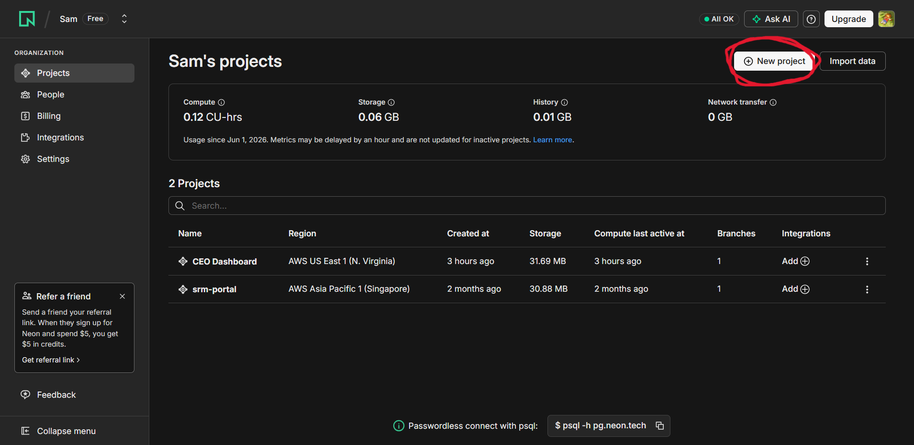
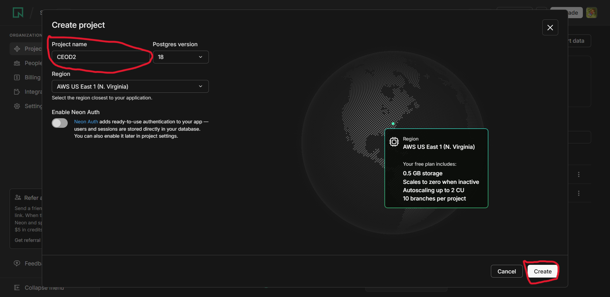
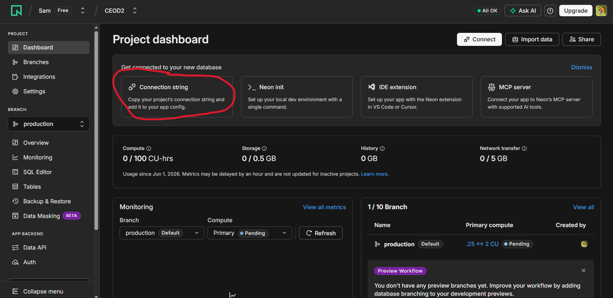
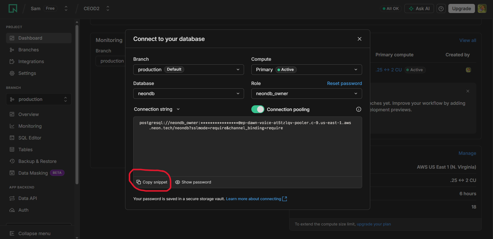
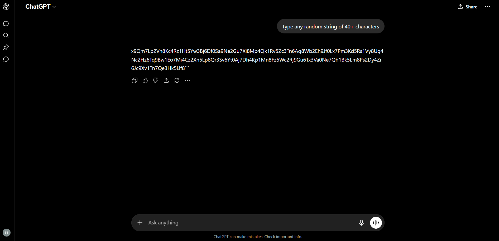
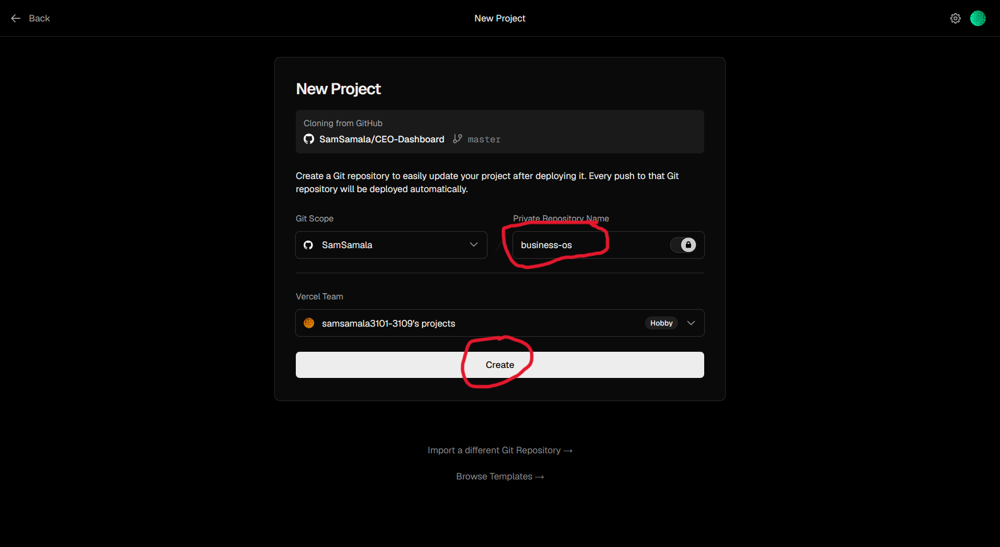
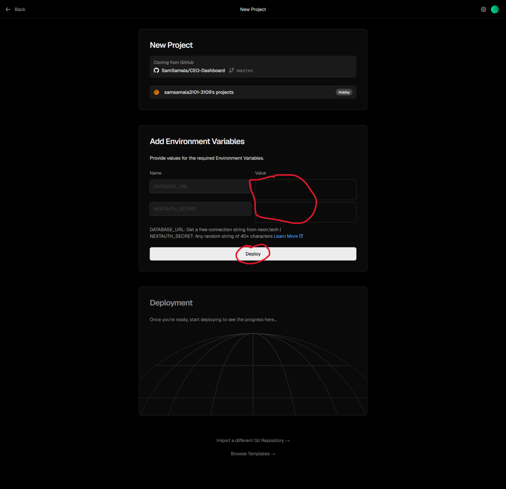
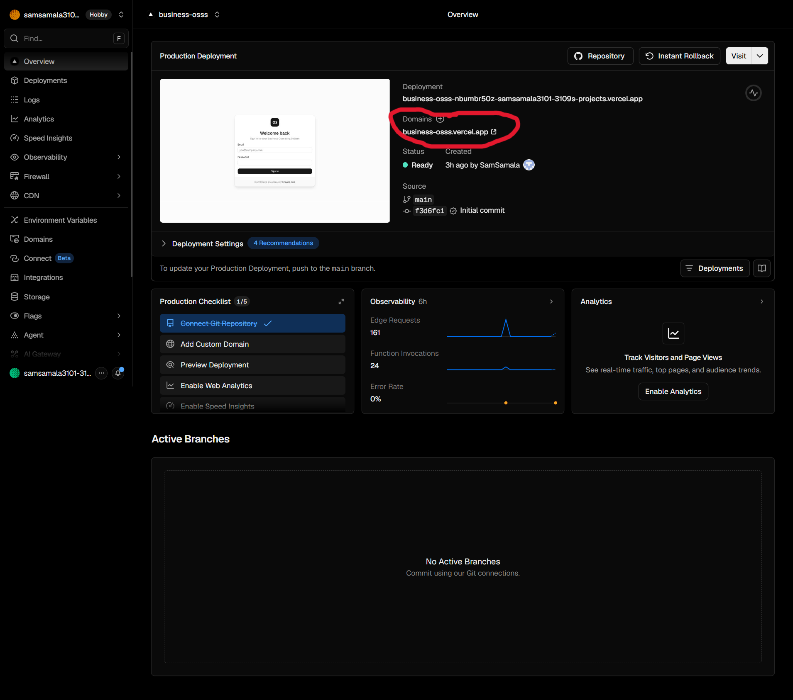
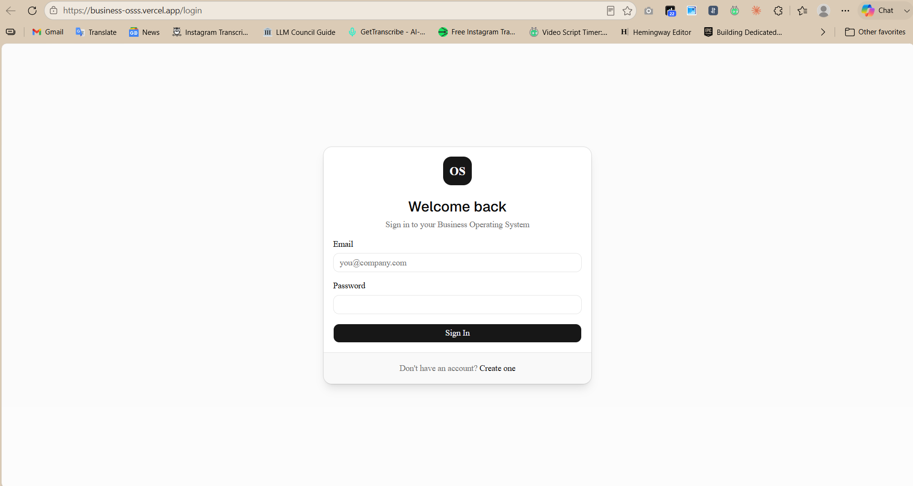
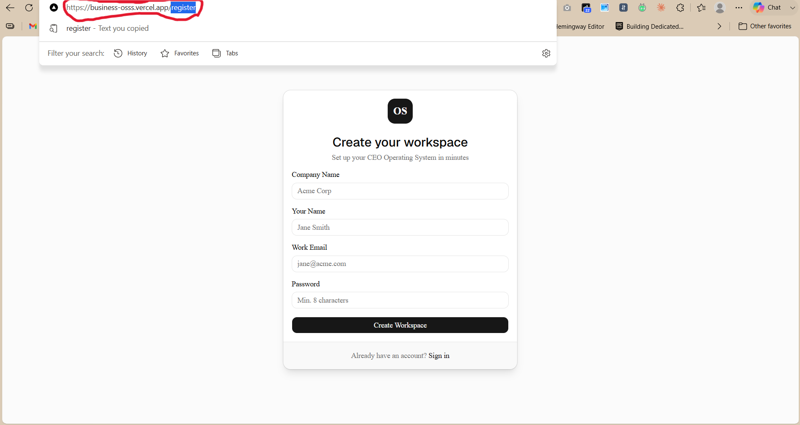

# CEO Business Operating System

A complete business operating system for founders and their teams. Track KPIs, detect bottlenecks automatically, manage approvals, monitor budgets, and get a real-time health score for every department. No technical setup — deploy in minutes with a free Vercel account.

---

## Setup Guide

Follow these 10 steps to get your dashboard live. No technical knowledge required.

---

### Step 1 — Create a free Neon database

Go to [neon.tech](https://neon.tech) and sign up for free. Once you're in, click **New project**.

---

### Step 2 — Name your project and create it

Give your project any name (e.g. `CEO Dashboard`). Leave everything else as default and click **Create**.

---

### Step 3 — Open the connection string

On the project dashboard, click **Connection string**.

---

### Step 4 — Copy the connection string

Click **Copy snippet**. This copies your database URL — you'll paste it into Vercel in a later step. Keep this tab open.

---

### Step 5 — Generate a secret key

You need a random secret key for security. The easiest way is to ask ChatGPT (or any AI): *"Type any random string of 40+ characters"* and copy what it gives you. Keep it somewhere — you'll paste it in the next step.

---

### Step 6 — Deploy to Vercel

Click the button below to start deploying. Log in to Vercel (or create a free account). You'll see a screen asking for a repository name — leave it as **business-os** and click **Create**.

---

### Step 7 — Paste your values and deploy

You'll see two fields:

- **DATABASE_URL** → Paste the connection string you copied from Neon (Step 4)
- **NEXTAUTH_SECRET** → Paste the random string you generated (Step 5)

Then click **Deploy**.

---

### Step 8 — Deployment complete

Wait about 2 minutes. Once done, Vercel shows your live URL. Click it to open your dashboard.

---

### Step 9 — Your dashboard is live

You'll see the login page. You don't have an account yet — go to the next step to create one.

---

### Step 10 — Create your CEO account

In the browser address bar, add `/register` to the end of your URL and press Enter.

Example: `https://business-osss.vercel.app/register`

Fill in your company name, your name, email, and a password. Click **Create Workspace**. The first account created is automatically the CEO account.

---

## Adding your team

Once logged in as CEO:

1. Go to **Settings → Roles & Permissions** → create roles for your team (e.g. Marketing Manager, Sales Rep)
2. Go to **Settings → User Management** → click **Add Employees** → enter their name and email
3. Share your dashboard URL with your team — they go to `/register` and sign up with the same email you added
4. They can log in from any device, any location, any network

---

## What it includes

- CEO executive dashboard with health score, bottleneck detection, action items
- Department KPI tracking (submit metrics, see trends, compare to targets)
- Bottleneck Center — automatically detects which department is slowing the business
- Approval workflows with configurable thresholds
- Hiring pipeline with candidate tracking
- Budget allocation and expense tracking
- Goal management (OKRs)
- Custom role system with granular permissions
- Employee account management
- Audit log of every action
- Data import from CSV/Excel
- Automated alerts and reports
